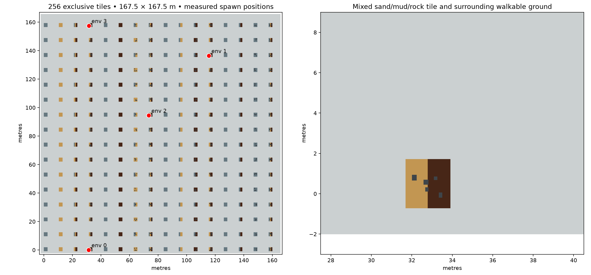

# Newton Terrain Lab

**[Explore the live showcase →](https://linjiw.github.io/newton-terrain-lab/)** · [Watch recorded native rollouts](https://linjiw.github.io/newton-terrain-lab/#simulations) · [Record your own](docs/showcase.md)

Reproducible terrain generation and experimental humanoid motion tracking on ground, sand, mud and rocks, with Newton MPM coupled to MuJoCo or Isaac Lab / Isaac Sim.

The default **167.5 × 167.5 m map** has **256 tiles**, **15 combinations** of ground/sand/mud/rocks, deterministic rock placement, random exclusive environment allocation, and four curriculum levels. Water is excluded from this training map.



**Latest training report (21 September 2026):** [Complete methods, rewards, settings and results](https://linjiw.github.io/newton-terrain-lab/training/). Two matched 256-rollout research runs completed. Original-depth soil failures were 56 at start, 53 after depth-scheduled training and 54 after direct training; both candidates failed tracking/usefulness criteria, and neither was promoted. The report includes the source/configuration provenance of the newer research workspace; this toolkit checkout alone does not reproduce that study. Sand and mud remain **uncalibrated demonstration presets**. Reliable deep-soil tracking and large-batch throughput remain unvalidated. Teacher weights, robot/motion assets and the external SONIC fork are not bundled.

## Start with map generation

Generation/export runs on CPU and does not require Isaac Sim, a policy, or Newton:

```bash
git clone https://github.com/linjiw/newton-terrain-lab.git
cd newton-terrain-lab
python3.11 -m venv .venv
source .venv/bin/activate
pip install -r requirements.txt
python dry_course.py --output assets/dry-map --rows 16 --columns 16 --seed 23
python plot_dry_map.py --course assets/dry-map/course.json --output outputs/overview.png
```

Use a fresh output directory for each generation. `course.json` describes material regions, rigid boxes, origins and curriculum levels; `course.usda` supplies the rigid collision scene and particle previews. Export a standalone MuJoCo scene with:

```bash
python export_mujoco.py --course assets/dry-map/course.json --output assets/dry-map/terrain.xml
```

Each 10 × 10 m tile contains a localized **2.2 × 2.4 m, 14 cm deep** material test region, surrounded by rigid walkable ground. Connecting walkways span the gaps. The whole map is not a continuous deformable soil volume. Rocks are randomized fixed box proxies. Mixtures are adjacent material regions, not a calibrated homogenized mixture law.

## What works in each simulator?

| Consumer | Supported path | Important boundary |
|---|---|---|
| Newton 1.6 | Implicit MPM material particles; rigid-body coupling and probes | Requires CUDA for the tested simulation path; soil presets are exploratory |
| MuJoCo 3.12 | Rigid XML export; `MPMBridge` returns external world-frame wrenches | XML alone contains no deformable sand or mud |
| Isaac Sim 5.1 | USD rigid scene; native live surface meshes via the runtime | Opening USD alone does not start Newton MPM |
| Isaac Lab | Shared terrain, exclusive origins, per-env MPM worlds, selective reset and contact reward fusion | Tested against the local SONIC TRL integration, not every Isaac Lab task |
| SONIC / motion2scene | Frozen G1 policy evaluation and a fresh-optimizer PPO warm start | Requires compatible external fork, checkpoints, robot and motion data; not a stock-SONIC turnkey installer |

## Train or evaluate a humanoid

Read **[the integration guide](docs/integration.md)** for required external files, settings, launch commands and how to adapt another task. The supported workflow is:

1. Generate a map and install Newton in a separate Python environment.
2. Configure your native Isaac/SONIC environment, compatible robot, checkpoint and disjoint motion pools in ignored `local.json`.
3. Run `python terrain_doctor.py --native` to check local dependencies, then prepare a fresh evaluation/training folder with `prepare_dry_run.py`.
4. Run a short evaluation, inspect finite-state/reset/contact receipts, then launch a small PPO smoke test before a longer curriculum run.

```bash
# After completing docs/integration.md setup:
python prepare_dry_run.py --output outputs/check --num-envs 2 --steps 120 --surfaces
python run_dry.py outputs/check
# Separate native GUI evaluation; requires a working display:
python run_dry.py outputs/check --view
# Explicitly launch the prepared training profile:
python run_dry.py outputs/check --mode train
```

Preparation does not launch training. Evaluation starts at the requested level; training starts at ground level 0. Environment origins are assigned to random exclusive tiles on reset, with a small safe-pad jitter. This is not unrestricted random placement inside deformable patches. The default allocator can reserve 64 environments at every level; **64 is a map-capacity bound, not demonstrated training throughput**. Current workers step independent MPM worlds sequentially over batched IPC.

For single-motion LAFAN dance preparation and the 1,024-env memory assessment, see [LAFAN training](docs/lafan-training.md). The requested large live-material run is prepared but not launched.

## Physics and rendering

Sand uses density 1600 kg/m³ and friction 0.75; mud uses density 1500 kg/m³, viscosity 100 Pa·s and yield stress 300 Pa. Full assumptions, resolution limits, force conventions and failed water checks are in **[the physics guide](docs/physics.md)**.

Particles are MPM material samples, not a pile of individually colliding spheres. `ParticleSurface` reconstructs a continuous display mesh from their positions. Smoothing changes appearance; it does not improve the constitutive physics. Static USD points, live reconstructed surfaces and recorded surface replays have different meanings; only the running bridge advances material physics.

## Validation

| Measured check on the development machine | Result |
|---|---|
| Native four-env mixed terrain evaluation | 180 control steps, finite actions/rewards, exit 0 |
| Selective reset | Other robot states and worker material states preserved |
| Native two-env contact/surface evaluation | 120 control steps, 24 surface updates, exit 0 |
| SONIC PPO smoke | 2 envs × 8 rollout steps, one update, finite changed policy parameters, 69 optimizer-state entries, exit 0 |
| Water physical acceptance | Failed; excluded from the recommended map |
| Long-horizon policy improvement / calibrated sand and mud | Not established |

These short runs establish execution and integration, not policy robustness or learning success. See [validation and reproduction](docs/validation.md).

```bash
pip install -r requirements-dev.txt
python -m unittest discover -s tests -v
ruff check .
```

The contact reward test requires Torch and skips when absent. Core tests generate temporary USD themselves; no private teacher or pre-generated run is needed. GPU and native simulator checks are separate from CPU CI.

## Source guide and next work

- `course.py`, `dry_course.py`, `export_mujoco.py`: shared schema, generation and rigid exports.
- `mpm_bridge.py`, `dry_mpm_worker.py`, `rigid_state.py`: material simulation and host-state/wrench conversion.
- `dry_runtime.py`, `dry_native_config.py`, `dry_rewards.py`: native scene, resets, material contacts and surfaces.
- `large_map.py`, `isaac_terrain_curriculum.py`: level scheduling and episode metrics.
- `prepare_dry_run.py`, `run_dry.py`, `dry_entry.py`, `dry_trainer.py`: optional SONIC evaluation/training integration.
- `terrain_probe.py`, `validate_material_basics.py`, `validate_buoyancy.py`: standalone physics experiments.
- Other single-course teacher/replay tools are historical diagnostic utilities; some expect prior output names and custom CPU teacher helpers. Use the dry workflow above for a new integration.

Useful next contributions include soil calibration (penetration, shear, slump), grid/time-step convergence, coupling energy checks, batched solver throughput, longer motion-tracking evaluations, and adapters for additional Isaac Lab tasks. Keep water experimental until containment, hydrostatics and settling checks all pass.

Code is licensed under Apache-2.0. External simulators, model weights and robot/motion assets retain their own terms; see [third-party notices](THIRD_PARTY_NOTICES.md).
