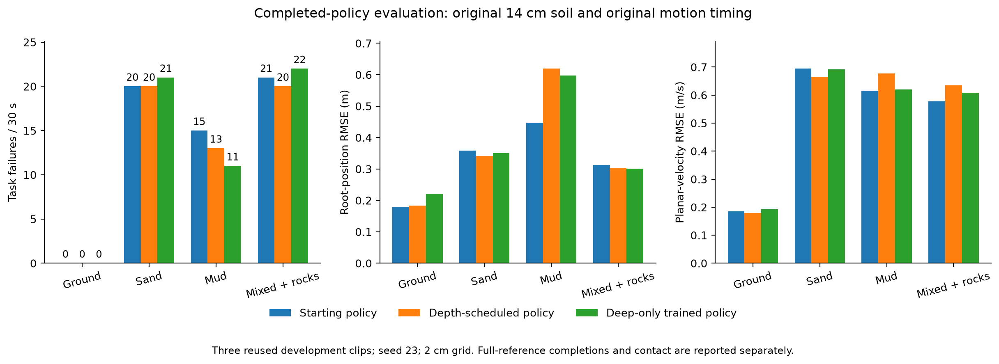
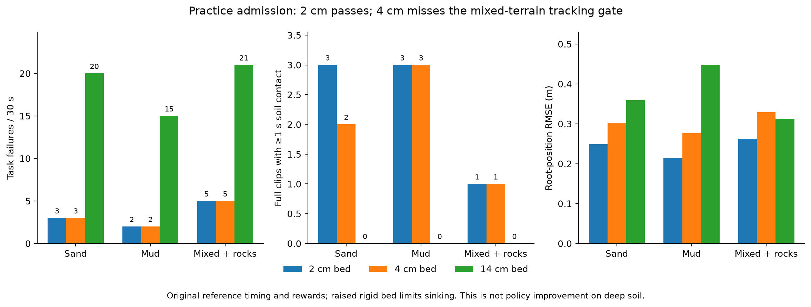
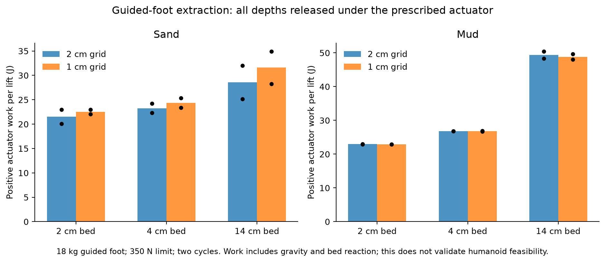
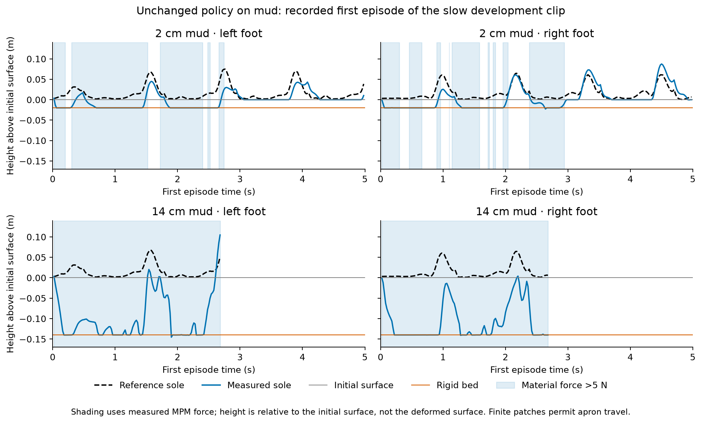

# Motion tracking on sand and mud: training progress and technical report

**Report date: 21 September 2026. Latest completed experiment: 20 September 2026.**

The latest controlled training round completed, but **a reliable deep-soil motion-tracking policy has not been demonstrated**. Both candidates learned finite parameters, retained the frozen SONIC backbone and passed execution checks. Their improvements in task-failure counts were small, mud tracking became worse, and neither completed the required full references across all soil families. No new checkpoint was promoted. This report documents the executed system and results; proposed changes in Section 13 have not been trained.

## 1. Current outcome and scope

The task is reference-conditioned G1 whole-body motion tracking while interacting with finite sand/mud patches, sometimes with rigid rocks, at the reference's original timing. It is not unconstrained forward-velocity locomotion, continuous travel across an infinite soil field, or a hardware demonstration. The robot moves through native articulated dynamics; the reference supplies targets and reset initialization, not frame-by-frame robot pose replacement.

The latest comparison starts from the retained 400-rollout research residual. One arm practices at **2 → 6 → 14 → 14 cm** soil depth; the matched control trains at **14 cm throughout**. Both add 256 rollouts with the same actor architecture, reward function, training data, phase seeds and optimizer restart schedule.

| Policy | Sand failures | Mud failures | Mixed + rocks failures | Soil total | Ground failures |
|---|---:|---:|---:|---:|---:|
| Starting research policy | 20 | 15 | 21 | 56 | 0 |
| Depth-scheduled policy | 20 | 13 | 20 | 53 | 0 |
| Direct 14 cm training | 21 | 11 | 22 | 54 | 0 |

Each family has **30 evaluated robot-seconds per policy**, comprising three 10-second runs with automatic resets. The soil total covers 90 seconds, not 90 independent trials. The scheduled reduction is 3/56 = **5.36%**; direct training reduces failures by 2/56 = **3.57%**. Neither meets the prespecified 20% requirement. Scheduled training is only one failure better than the equal-budget control; this does not establish a curriculum benefit.



The starting policy remains a **research reference**, not an approved terrain controller. The public showcase's older step-8,000 teacher videos are a different checkpoint, grid and experiment; they do not visualize these trained candidates.

## 2. Experimental history and what changed

| Stage | Executed intervention | Finding and decision |
|---|---|---|
| Integration and recovery work, 13–15 September | Native articulated dynamics with per-environment MPM; selective resets; fused material contacts; recovery allowances; PPO/replay and precision audits | Established a functioning experimental loop. Integration success alone did not establish locomotion quality. |
| Reward screen, 18 September | Three original-teacher warm starts, 80 rollout updates / 7,680 transitions each: baseline recovery, reduced smoothing, softer imitation plus progress | On the reused slow diagnostic and two evaluation seeds, soil failures were 12 for the teacher, 12 for baseline retraining, 12 for compliance and 13 for terrain-task. No reward package was adopted. These use a different panel from the latest study. |
| Residual adaptation, 19 September | Added eight kinematic feedback features and a bounded residual; separate actor/critic handling and corrected timeout bootstrap; selected 320 + 80 rollout lineage | Improved a slow mud diagnostic, but the broader motion panel remained unstable. Retained the 400-rollout residual for research comparisons only. |
| Tempo curriculum, 19 September | Two 512-rollout / 49,152-transition arms; adaptive reference rates versus original speed; three clips and two evaluation seeds | Soil failures were 122 at start, 122 adaptive and 125 full-speed control across 60 s/family. Adaptive soil environments did not advance their speed levels. No promotion. This panel is not interchangeable with the later 56-failure baseline. |
| Contact and leg capacity, 19 September | Actual-foot probes; rejected firmer-material pilot; matched 128-rollout narrow-residual and expanded-leg training | Target-panel failures: 56 at start, 60 narrow continuation, 59 expanded legs. Extra leg range was used but did not improve the task. Firm-material practice had 69 failures versus 56 on target presets, so its long curriculum was not launched. |
| Depth practice and transfer, 20 September | Shallow-depth admission, load/lift probes, four-phase smoke test, then two matched 256-rollout arms | The 2 cm practice pilot passed; final 14 cm results were 56 / 53 / 54. Both trained candidates failed acceptance. |

Earlier experiments differ in checkpoint, motion panel, timing, physics resolution or denominator. Their failure totals must not be placed on a single unqualified learning curve. The latest depth study held all twelve rewards fixed: it tested practice distribution, not a new reward ablation.

## 3. Simulator, software and control loop

**Host dynamics:** Isaac Lab / Isaac Sim, PhysX articulation, native SONIC manager-based environment. **Material dynamics:** Newton 1.6.0 implicit MPM in a separate worker process. MuJoCo supplies the nominal coupling model's forward kinematics, collision shapes and inertial information; it does not separately integrate the native robot during this experiment.

At every 5 ms physics tick, the bridge exchanges the measured root/joint state and body centers of mass, updates local collision geometry, advances the material, and returns world-frame forces and COM torques. PhysX applies the returned wrench during the next host step. This is explicit coupling with a one-tick timing approximation, not a monolithic coupled solver or Isaac Lab's native Newton backend.

| Setting | Executed value |
|---|---|
| Hardware | One NVIDIA GeForce RTX 5080, reported 16,303 MiB memory |
| Native Python / Torch | 3.11.16 / 2.7.0+cu128 |
| Native NumPy / Warp / MuJoCo | 1.26.4 / 1.16.0 / 3.12.0 |
| Native Transformers / TRL | 4.57.6 / 0.28.0 |
| Worker Python / NumPy | 3.11.16 / 2.4.6 |
| Worker Newton / Warp / MuJoCo | 1.6.0 / 1.17.0 / 3.12.0 |
| Native source revision | `2a3cfb476229fd3fd96761b5b9839a835aae1308` plus recorded file hashes |
| Host physics step / policy decimation | 0.005 s / 4 |
| Physics / policy frequency | 200 Hz / 50 Hz |
| Maximum episode horizon | 10 s / 500 control steps |
| Active environments | Four, one per selected terrain family |
| Precision | FP32; bf16/fp16 disabled; CUDA matmul and cuDNN TF32 disabled |
| Visualization during training | Headless; surface rendering disabled |
| Tracking | Local JSON/JSONL receipts; W&B disabled for this study |

Each environment owns an independent local MPM world. IPC is batched, but the worker steps the worlds sequentially. The 256-tile map is spatial capacity, not 256 simultaneously simulated training environments. No large-batch throughput result follows from the map size.

Source: [environment receipt](appendices/environment.json), [training runtime](appendices/training-runtime.json), [source provenance](appendices/source-provenance.json).

## 4. Terrain geometry and constitutive settings

### 4.1 Course and task selection

The dry map contains 16 × 16 tiles on a 10.5 m pitch, spanning 167.5 × 167.5 m. A tile's walkable bounds are local XY `[-2, -2]` to `[8, 8]` m. Its material region is much smaller: **2.2 × 2.4 m**, local x = 0.20–2.40, y = −0.70–1.70 m. Rigid aprons surround the patch at z = 0. The nominal material top is z = 0; the original bottom is z = −0.14 m. The box bottom extends down to −0.20 m.

The generator supplies fifteen ground/sand/mud/rock combinations and four level labels. Level 0 is ground; level 1 contains simpler soil families; level 2 includes soil pairs and rock combinations; level 3 includes mixed sand/mud/rocks. Each level has 64 tiles. **The depth study does not run automatic level promotion.** It fixes one family per environment and changes only bed depth between processes.

Training families are `ground`, `sand`, `mud`, `sand+mud` (25% of environment slots each). Evaluation families are `ground`, `sand`, `mud`, `sand+mud+rocks`. Thus the mixed evaluation includes rocks not present in the mixed training slot. Single-soil failures show that rocks are not necessary for failure, but this added mixed-terrain difficulty remains a limitation.

Mixed-material patches are adjacent strips, not a homogenized mixture or a saturation model. Water is absent as a separate phase. “Dry” is the map's water-exclusion label; it does not turn mud into dry granular sand.

Rock proxies are fixed boxes. A rock-containing tile receives `2 + level` boxes. Centers are sampled at x = 0.60–2.15 m and y = −0.45–1.45 m; horizontal half-sizes are 0.06–0.14 m. Tops are sampled from 0.025 m to `0.04 + 0.025 × level` m; bases extend to −0.14 m. Level-3 mixed tiles therefore have five rocks with tops up to 0.115 m. Particles initially inside rock boxes are omitted. This is block-proxy geometry, not scanned natural rock morphology.

The native USD rigid material uses static/dynamic friction 0.8 and restitution 0. The nominal MuJoCo rigid geometry has friction components `0.8, 0.005, 0.0001`. Those engine-specific parameters should not be interpreted as proof of identical contact dynamics across engines.

### 4.2 Sand, mud and solver parameters

| Material parameter | Sand | Mud |
|---|---:|---:|
| Density (kg/m³) | 1,600 | 1,500 |
| MPM friction parameter | 0.75 | 0 |
| Viscosity parameter (SI stress/strain-rate convention) | 0 | 100 |
| Yield stress (Pa) | 0 | 300 |
| Yield pressure (Pa) | Newton default: 1e15 | Explicit: 1e10 |
| Tensile-yield ratio | Newton default: 0 | Explicit: 1 |

The explicit presets are checked against worker material arrays. They are **illustrative constitutive choices, not measured real-soil calibration**. Mud is represented with viscosity and yield resistance; there is no explicit pore-pressure, water transport, moisture-dependent saturation, drainage or suction process.

Unspecified material parameters inherit installed Newton defaults. Report-date source inspection found Young's modulus 1e15 Pa, Poisson ratio 0.3, damping 0, hardening 0, hardening rate 1, softening rate 1, and dilatancy 0. These large stiffness/yield defaults must not be presented as measured physical sand stiffness. The distinction between explicit worker read-back and reconstructed defaults is preserved in [MPM defaults](appendices/mpm-defaults-and-solver.json).

| Numerical setting | Value |
|---|---|
| Policy-training and final-evaluation voxel size | 0.02 m |
| MPM solver | Implicit MPM; `solver=auto`, `warmstart_mode=auto` |
| Maximum iterations / tolerance | 50 / 1e−4 |
| Grid | Sparse; default padding 0 |
| Transfer / integration | APIC / PIC |
| Strain / velocity / collider basis | P0 / Q1 / S2 |
| Collider velocity mode | Forward |
| Critical fraction / air drag | 0 / 1 |
| Particle initialization | Regular grid, zero velocity, no jitter; target spacing h/2 |
| Particle mass | Density × actual sample-cell volume |
| Particle radius | `cuberoot(dx × dy × dz) / 2`, matching Newton's `(2r)^3` volume convention |

The particle dimension along each axis is `ceil(patch_extent / (h/2))`; actual spacing is then extent divided by that integer. Recorded single-soil worlds contain **792,000 particles at 14 cm**, 316,800 at 6 cm and 105,600 at 2 cm. At 14 cm, floating-point rounding before `ceil` produces 15 vertical particle layers, rather than the idealized 14. Adjacent-strip rounding also changes counts slightly: the training sand+mud worlds have 795,600 / 318,240 / 106,080 particles at those depths. These are particle counts, not MPM cell counts: the original depth is seven cells and 2 cm practice only one cell. [Worker counts and material read-back](appendices/worker-material-summary.json) preserve the executed values. The 1 cm guided-foot probes do not establish whole-policy grid convergence.

The shallow intervention raises the rigid bed and clips the particle bounds together while keeping the initial top at zero. Depths are validated in [0.02, 0.14] m; water/layered cases are rejected by this dry-depth helper. Every depth phase starts a new native process. No bed is moved under a contacting robot, and no material coefficient, actuator limit or reference speed is changed by this intervention.

### 4.3 Contact coupling and its limits

Newton supplies collider impulses `J` at points `p`. The adapter computes `F = J / dt` and `tau = (p − COM) × F`, sums them per link, and transfers child-link wrenches to the matching native ancestor with the additional moment arm. Shapes do not add spurious link mass. Finite-state checks reject invalid inputs or returned wrenches.

Before the next material solve, the previous force-induced velocity increment is approximately removed using each isolated link's mass and inertia. An articulation's response is actually coupled through joints, drives and contacts. This approximation is a consequential modeling limitation; the report's post-hoc effective-mass audit is discussed in Section 12. No causal benefit from a corrected coupling model has been tested.

## 5. Robot, actions and policy architecture

### 5.1 G1 actuation

The task uses the native `g1_model_12_dex` configuration with 29 actuated joints, a floating base and pelvis anchor. Actions are normalized joint-position commands, not torques. The wrapper clips the **combined command** to ±20, then applies per-joint action scales and default joint offsets. Implicit PD drives execute the targets with the configured effort/velocity limits.

For each joint, the scale is `0.25 × effort_limit / stiffness` radians per normalized unit. The current robot source uses natural frequency 10 Hz and damping ratio 2: `Kp = armature × (20π)^2`, `Kd = 4 × armature × 20π`. Values below are rounded from the source; action scales agree with native audit metadata.

| Joint group | Kp | Kd | Armature | Effort limit (N·m) | Velocity limit (rad/s) | Action scale (rad/unit) |
|---|---:|---:|---:|---:|---:|---:|
| Hip pitch/roll, knee | 99.0984 | 6.3088 | 0.025101925 | 139 | 20 | 0.350661 |
| Hip yaw; waist yaw | 40.1792 | 2.5579 | 0.010177520 | 88 | 32 | 0.547546 |
| Ankle pitch/roll; waist pitch/roll | 28.5012 | 1.8144 | 0.00721945 | 50 | 37 | 0.438577 |
| Shoulder pitch/roll/yaw, elbow, wrist roll | 14.2506 | 0.9072 | 0.003609725 | 25 | 37 | 0.438577 |
| Wrist pitch/yaw | 16.7783 | 1.0681 | 0.00425 | 5 | 22 | 0.074501 |

Soft joint-position limits use 90% of the hard range. Native self-collision is enabled; articulation solver position/velocity iterations are 8/4. Initial nominal joint offsets include hip pitch −0.312 rad, knee 0.669, ankle pitch −0.363, elbow 0.6, shoulder pitch 0.2, and left/right shoulder roll ±0.2. Actual training reset poses come from the sampled reference plus the bounded reset noise below.

Each ankle-roll foot collider is a set of seven capsules, with radii 0.008–0.010 m. Clearance diagnostics use the lowest transformed capsule point, not the ankle link origin. Exact capsule endpoints, all 29 joint names, their interleaved native action order and measured scales are in [contact geometry](appendices/contact-geometry-and-action-scales.json). Leg indices are `0,1,3,4,6,7,9,10,13,14,17,18`; treating the first twelve action entries as the legs would be incorrect.

### 5.2 Frozen SONIC and trainable residual

The teacher identity is the repaired motion2scene release with SHA256 `afd649cfbbfd28833550e11a0f8c3b7a5f6a05ee8b4021dd0dac97a6f94733ce`. The latest comparison starts from the separately learned 400-rollout residual checkpoint, not directly from the release or from the showcase's step-8,000 teacher.

Only the G1 reference encoder is sampled: probabilities G1 1.0, teleop 0, SMPL 0. The G1 encoder hidden widths are 2048/1024/512/512 with SiLU. The frozen dynamic decoder uses 2048/2048/1024/1024/512/512 with SiLU. The configuration uses two maximum FSQ tokens and 32-level quantization settings. Auxiliary reconstruction fields remain in the inherited YAML, but the residual subclass disables auxiliary loss and runs the teacher without gradients. All 54 tensors in the frozen `actor_module` are checked unchanged.

The base residual and added branch are each MLPs with 128/128 hidden units, SiLU, a 29-dimensional output and tanh bounds. Their input is the 930-dimensional proprioception/action history, the 29-dimensional teacher mean, and eight feedback features: **967 input values**. Proprioception and teacher means are clipped to ±10 before residual input concatenation. The base residual has 144,157 trainable parameters; two branches give 288,314. The existing branch remains trainable during adaptation.

The mean action is:

```text
mu = frozen_teacher(observation)
     + 0.25 * tanh(base_MLP(features))
     + leg_mask * 0.75 * tanh(extra_MLP(features))
```

The additional branch starts with a zero output layer. Its first native forward verifies exact preservation of the starting policy's output; later phases load both branches strictly. Total residual bounds are ±1.0 on twelve leg actions and ±0.25 elsewhere. These are normalized corrections added to the teacher, **not torque limits or total-action limits**. For example, an ankle's ±1 correction corresponds to ±0.4386 rad of target offset before combined-action clipping and physical drive constraints.

## 6. Observations, references and data sampling

| Input or reference setting | Executed contract |
|---|---|
| Actor history | Ten samples each of gravity direction (3), base angular velocity (3), relative joint position (29), relative joint velocity (29), previous action (29): 930 values |
| History duration | About 0.2 s at 50 Hz; no learned recurrent state in this residual |
| Future G1 reference | Ten reference frames spaced 0.1 s apart; 50 Hz motion-library target FPS |
| Active reference content | Future joint/command features and anchor orientation through the G1 encoder |
| Actor running normalization | Disabled |
| Critic | 1,645 input values: privileged state and reference features, including ten-sample proprioceptive/action histories; running normalization enabled |
| Critic network | MLP 2048/2048/1024/1024/512/512 → scalar value; SiLU; 11,503,105 optimizer parameters |
| Explicit terrain sensing in actor | No height map, material label, particle state, foot-contact estimate or soil encoder |
| Extra feedback | Eight simulator-derived kinematic progress features |

The eight feedback values are robot-heading-frame XY reference-position error clipped to ±1 m; heading-frame reference and measured XY velocities clipped to ±3 m/s and divided by 3; Z reference-position error clipped to ±0.6 m and divided by 0.6; and measured vertical velocity clipped to ±3 m/s and divided by 3. These use simulator state. A deployment-equivalent position/velocity estimator has not been validated.

Policy observation corruption is configured as additive uniform noise: gravity ±0.05, base angular velocity ±0.2 rad/s, joint positions ±0.01 rad, and joint velocities ±0.5 rad/s. Previous actions have no added noise. Tokenizer orientation terms also have configured ±0.05 component noise. The added progress group is uncorrupted; critic capture requires pure, noiseless observation terms. Evaluation takes policy mean actions and disables command reset jitter, but the recorded policy/tokenizer configuration still enables observation corruption. “Deterministic policy evaluation” does not mean every simulator input is noiseless.

The fourteen tracked bodies are pelvis; left/right hip roll, knee and ankle roll; torso; and left/right shoulder roll, elbow and wrist yaw. The configured local reward points are torso offset `[0,0,0.5]` m and the two wrist-yaw links at zero offset.

The approved pool has **84 training clips: 47 navigation and 37 locomotion**, with 20 disjoint reserved clips. Reserved clips were not used for tuning or this evaluation. Adaptive failure-based motion sampling, frame-freeze augmentation and upper-body pose concatenation are disabled. Original reference speed is 1.0; pose sequences, derivatives and future timestamps retain their original timing.

Training samples a reference phase while leaving at least two seconds remaining: `floor(U[0,1) × max(length−2,0) × simulation_FPS)`. Short clips remain eligible and start at zero. This alters start time, not motion identity, timing scale or physical episode duration. Actual observed coverage was **77/84 motions scheduled**, **81/84 direct**. Training observed 221 scheduled episode starts with only **2 at reference time zero**, and 292 direct starts with only **1 at zero**. Evaluation always starts at zero. This mismatch is an observed fact; its causal contribution to failure remains untested.

| Development evaluation clip | Duration | Mean reference planar speed |
|---|---:|---:|
| `indoor_00792` | 5 s | 0.822 m/s |
| `indoor_00509` | 8 s | 1.055 m/s |
| `indoor_00674` | 6 s | 1.312 m/s |

These three clips are reused development/training motions, not a held-out test set. Exact data and checkpoint identifiers are in the [dataset integrity](appendices/dataset-integrity.json) and [comparison](appendices/comparison.json) appendices.

## 7. Complete reward specification

The current `baseline` is the **terrain recovery profile**, not untouched SONIC defaults. At each policy step, `reward = 0.02 × sum(weight_i × raw_term_i)`. Logged reward rates already include weights. A kernel width controls reward sensitivity; it is not a termination threshold. Terms are not clipped to a nonnegative total.

Let `theta(q1,q2)` be the sign-invariant quaternion angular error in radians. Mean body errors below are over the selected tracked bodies. The native relative-body reference is translated to the robot's XY anchor, retains reference anchor height, and is rotated by the robot/reference heading difference; it is not a full six-dimensional root-pose substitution.

| Reward term | Weight | Raw calculation / parameters | Purpose and relevant tension |
|---|---:|---|---|
| `tracking_anchor_pos` | +0.5 | `exp(−dx²/0.30² − dy²/0.30² − dz²/0.45²)` | Global progress/position tracking with wider vertical tolerance; XY/Z factors still multiply. |
| `tracking_anchor_ori` | +0.5 | `exp(−theta²/0.40²)` | Reference pelvis orientation. |
| `tracking_relative_body_pos` | +1.0 | `exp(−mean(squared 3D position error)/0.30²)` to the heading-aligned relative reference | Retains body configuration while permitting global XY displacement; still constrains leg adaptation and height. |
| `tracking_relative_body_ori` | +1.0 | `exp(−mean(theta_body²)/0.40²)` to the relative reference | Retains articulated orientation patterns. |
| `tracking_body_linvel` | +0.75 | `exp(−mean(squared 3D velocity error)/1.50²)` | Tracks world-frame limb velocities; may conflict with delayed soil extraction. |
| `tracking_body_angvel` | +0.75 | `exp(−mean(squared angular-velocity error)/3.14²)` | Tracks world-frame angular motion. |
| `tracking_vr_5point_local` | +2.0 | `exp(−mean(squared local reward-point position error)/0.10²)` | Despite the name, **three configured torso/wrist points**; each pose is transformed into its own full anchor frame. No foot points in this term. |
| `action_rate_l2` | −0.1 | Sum over 29 joints of squared change in applied normalized action | Penalizes command variation, not mechanical energy or directly measured jerk. Combined commands are clipped to ±20 first. |
| `joint_limit` | −10.0 | Sum of joint-position excess beyond native soft limits | Keeps joints away from range extremes; not a squared penalty. |
| `undesired_contacts` | −0.1 | Count of selected bodies exceeding 5 N in native contact history **or** material force | Fuses contact sources without double-counting a body. Exempts ankle pitch/roll, wrist-yaw and elbow links. |
| `anti_shake_ang_vel` | −0.005 | Mean `max(norm(angular_velocity)−1.5,0)²` | Configuration requests two wrists and head; only the two wrists are in the tracked list and selected. Absolute speed penalty, not reference angular error. |
| `feet_acc` | −2.5e−6 | Sum of squared ankle-joint accelerations | Despite the name, this is joint acceleration, not Cartesian foot acceleration. |

The maximum sum of positive kernel weights is **6.5 per second**, or 0.13 per 20 ms step. There is no separate alive bonus, explicit pelvis planar-velocity term, energy/power term, slip penalty, sinkage penalty, swing-clearance reward, fixed-airtime reward, footfall-phase reward, terminal failure penalty, AMP discriminator or terrain-estimation objective in this baseline. Failure nevertheless affects return by ending the trajectory and removing future rewards.

### Reward changes already tested

The recovery profile already widened anchor height tolerance, removed end-effector and foot-position failure terms, reduced body linear/angular velocity weights to 0.75, widened linear-velocity width to 1.5, raised fused-contact threshold to 5 N and exempted foot assemblies from the contact penalty. It also disabled inconsistent host-only dynamics randomization.

The earlier `compliance` experiment changed action rate −0.1 → −0.03, ankle acceleration −2.5e−6 → −5e−7 and removed anti-shake. The earlier `terrain_task` package additionally changed relative body position to weight 0.5/width 0.4, relative orientation to 0.5/0.6, local torso/wrist tracking to 1.0/0.18, body linear/angular velocity weights to 0.5/0.25, and added pelvis XY velocity weight 1.0/width 0.75. Neither package improved the full diagnostic comparison sufficiently. These packages remain experiments, not current defaults.

Other optional code paths such as axis-separated anchor tracking, a standalone progress reward, orientation hold, tempo curricula and firmer soil do not imply those features were active in the latest run. [Effective reward/reset settings](appendices/effective-settings.json) take precedence over stale inherited YAML fields.

## 8. Events, resets and terminations

The effective event-manager dictionary is **empty**. Physics-material/friction randomization, base-COM randomization, rigid-body mass randomization, pushes and joint-default-position randomization are disabled. These would otherwise change host dynamics without a corresponding change to the material worker. There are no periodic push events in this experiment. Motion-command reset noise is separate from event-manager entries.

| Training reset quantity | Range |
|---|---|
| Root translation X/Y | ±0.02 m |
| Root translation Z | 0 |
| Root roll/pitch | ±0.03 rad |
| Root yaw | ±0.10 rad |
| Root linear velocity X/Y | ±0.05 m/s |
| Root linear velocity Z; angular velocities | 0 added noise |
| Joint position | ±0.03 rad |
| Joint velocity | 0 added noise |

At reset, an environment receives a free tile of its fixed family, sampled exclusively so active robots never share a tile. A two-second reference-path lookahead chooses a translation favoring total soil occupancy, then uninterrupted initial soil occupancy, then tile margin. Candidate placement uses a 0.30 m interior/rock clearance and up to 100 random proposals per patch plus deterministic candidates. If no safe interior candidate exists, the start-pad fallback remains possible. Ground uses its own valid tile placement.

Robot and reference are translated by the same XY amount; reference direction, Z, timing and velocity are preserved. Placement does not guarantee dynamic feasibility or complete foot containment. Reset recreates only that environment's MPM world and clears its previous wrench, contact accumulation and failure counters. Hash checks verify that other material worlds are unchanged.

| Termination | Executed rule | Return/scoring treatment |
|---|---|---|
| `anchor_pos` | Absolute pelvis/reference height error >0.30 m sustained 0.30 s after 0.20 s grace; immediate >0.60 m or nonfinite position | Task failure; despite name, no general XY-distance cutoff |
| `anchor_ori_full` | Squared full quaternion error >0.64 rad², equivalent to angle >0.8 rad ≈45.84° | Immediate task failure; orientation hold is 0 |
| `tile_boundary` | Root XY reaches or crosses the assigned tile bounds | Task failure |
| Native `time_out` | Reference reaches its end | Reference completion; no continuation bootstrap |
| `episode_time_limit` | 10 s control horizon | Artificial truncation; bootstrap terminal successor value if no failure or clip end coincides |
| End-effector / foot-position tracking failures | Disabled by recovery profile | Not used to end episodes |

The orientation limit is **relative full orientation error**, not an absolute pelvis-tilt threshold. Tilt relative to world vertical is a separate diagnostic. Simultaneous failure wins over time-limit completion. Reset-separated fragments cannot be concatenated into a successful traversal.

## 9. PPO settings and numerical safeguards

| PPO / optimization setting | Executed value |
|---|---|
| Collection | 24 control steps × 4 environments = 96 transitions per rollout |
| Optimization | Four epochs; one minibatch per epoch; 96 transitions per epoch; shuffle each epoch |
| Discount / GAE | Gamma 0.99 / lambda 0.95 |
| Policy clip / value clip | 0.2 / 0.2 |
| Value loss | Clipped value loss, coefficient 1.0 |
| Entropy coefficient | 0.01; action standard deviation is fixed, so this does not learn exploration variance |
| Training action distribution | Diagonal Gaussian around teacher + residual, sigma 0.10 per normalized action |
| Standard-deviation parameters | Frozen; recorded override is 0.10, not inherited initialization 0.05 |
| Actor / critic learning rates | Both 1e−4 in actual optimizer groups |
| Optimizer | Installed Transformers AdamW default for Torch 2.7; beta1 0.9, beta2 0.999, epsilon 1e−8, weight decay 0 |
| Gradient norm limits | Actor 0.1; critic 1.0, clipped separately |
| Advantage normalization | Across rollout time and environments, with epsilon 1e−8 |
| LR schedule | Constant; desired-KL adaptation disabled |
| Post-update guard | Mean diagonal-Gaussian KL ≤0.10; nonfinite or excessive update aborts |
| First-epoch replay checks | Maximum mean-action mismatch ≤5e−4; log-probability mismatch ≤0.02 |
| Restart behavior | Carry actor and critic weights strictly; create a fresh optimizer each phase |
| Checkpoint schedule | Periodic and final weights at 64-rollout phase completion |

The report distinguishes effective settings from inherited fields: `algo.config.critic_learning_rate=0.001` and `load_optimizer=true` still appear in a source YAML, but the custom trainer creates separate groups at 0.0001 and asserts an empty optimizer state. The actual [initialization receipt](appendices/initialization.json) records this behavior. Checkpoints are weight warm starts, not exact optimizer/RNG/simulator-state resume points.

For PPO, the likelihood ratio multiplies the normalized GAE advantage and is clipped to [0.8,1.2] in the surrogate objective. Value clipping constrains changes around stored values. The eight progress features affect the actor residual, while the critic uses the existing privileged observation group; adding a reward does not automatically add the corresponding measurement to the actor.

The custom timeout repair removes the native preceding-state value bootstrap and adds the **pre-reset successor-state** value only for artificial horizon truncations. It does not bootstrap true reference ends or failures. The successor critic observation advances the reference cursor and cloned critic histories without mutating live histories or drawing new reset noise.

Likelihood replay is checked before the first optimizer epoch for each collected batch. A guarded encoder replay repair can impose consistent batching if the frozen token encoder crosses a numerical quantization boundary; it must preserve the collected behavior and pass the original tolerances before an update. This is not permission to train through a bad replay. Later epochs naturally differ as parameters change. Maximum logged KL was **0.04536 scheduled** and **0.07079 direct**. Maximum normalized corrections were **0.6720** and **0.7082**. All retained updates passed the guards; that establishes numerical integrity, not locomotion competence.

## 10. How the latest experiment was conducted

### 10.1 Admission and physical probes

Before training the candidates, the unchanged research policy was evaluated on 4 cm and original 14 cm soil, then on the predeclared 2 cm fallback. The original-depth evaluations were reused once in the fallback through verified paths, not counted as extra trials. Admission required at least 50% fewer pooled soil failures, zero ground failures, tracking retention in every soil family, sufficient actual contact, and full references with contact in each soil family.

| Practice depth | Soil failures | Full references with ≥1 s soil contact, sand / mud / mixed | Admission |
|---|---:|---|---|
| 14 cm original | 56 | 0 / 0 / 0 | Baseline |
| 4 cm | 10 | 2 / 3 / 1 | Rejected: mixed-terrain root RMSE 0.329 m >0.312 m baseline |
| 2 cm | 10 | 3 / 3 / 1 | Passed all practice checks |

The 2 cm pilot's contact durations were 17.08 s sand, 14.605 s mud and 16.20 s mixed out of 30 s each. Its root RMSEs were 0.249, 0.214 and 0.263 m; planar velocity RMSEs were 0.239, 0.212 and 0.248 m/s. Even at 2 cm, the fastest clip produced no full soil-reference completion. The gain here comes from changing physical support for an unchanged policy; it is not evidence that learning improved deep-soil control.



Twelve actual-foot guided extraction cases covered sand/mud, depths 2/4/14 cm and 1/2 cm voxel sizes, with two load/lift cycles each. The guide uses seven G1 left-foot capsules, an 18 kg vertical mass, rotation constrained with inertia 1e8, a 350 N actuator cap, Kp 4000 and Kd 160 with gravity compensation. Each 1.5 s cycle loads for 0.75 s, lifts for 0.5 s and holds for 0.25 s; the lift sole target is +0.10 m.

All 24 cycles met the specified 100 ms release condition (material force below 5 N and sole above +0.02 m), with finite particles and the sole within the allowed 1 cm floor tolerance. Mud positive actuator work was approximately 23 J at 2 cm versus 48–50 J at 14 cm. This includes gravitational work over a longer lift, not just mud drag. The guided mass is not an articulated humanoid, and numerical contact peaks/floor penetration remain limitations. These probes support a bounded feasibility screen, not physical calibration or policy grid convergence.



### 10.2 Matched learning schedule

| Phase | Seed | Scheduled depth | Direct depth | Rollouts / transitions / optimizer steps per arm |
|---|---:|---:|---:|---|
| 0 | 23 | 2 cm | 14 cm | 64 / 6,144 / 256 |
| 1 | 24 | 6 cm | 14 cm | 64 / 6,144 / 256 |
| 2 | 25 | 14 cm | 14 cm | 64 / 6,144 / 256 |
| 3 | 26 | 14 cm | 14 cm | 64 / 6,144 / 256 |
| Total retained lineage | One staged seed sequence | Final half at target | All at target | **256 / 24,576 / 1,024** |

A four-phase integration smoke test first completed eight rollouts, 768 transitions and 32 optimizer steps. Its weights were not used to initialize the comparison. Full arms started from the same retained research checkpoint; the new leg branch initially contributed exactly zero. Phase promotion followed fixed budgets, not measured competence. There was no deep-soil rehearsal during the first two scheduled phases.

Two unexplained SIGTERMs interrupted the scheduled 6 cm phase. One discarded attempt had 5,448 transitions and 224 optimizer steps; the next had 3,468 and 144. Neither partial policy was carried forward. The final serialized recovery restarted from the completed 2 cm checkpoint with the same phase seed and fresh optimizer. Its overlapping transition prefixes reproduced both archived attempts exactly, then all training and evaluations completed.

Thus **retained learning budgets match, physical computation does not**: scheduled executed 33,492 training transitions / 1,392 optimizer steps including discarded attempts, versus direct 24,576 / 1,024. The 768 smoke transitions are additional. The sender/cause of SIGTERM was not identified; no recorded optimizer guard failure explains it. [Attempt accounting](appendices/attempts.json) preserves this distinction.

### 10.3 Evaluation and selection contract

Each final checkpoint was frozen for three 500-step evaluations at reset seed 23, original 14 cm depth, 2 cm grid and original reference timing. All policies used matching effective evaluation settings and clip-wise initial placement receipts. Subsequent trajectories and reset sequences diverge as policies fail at different times; this is not frame-wise pairing after resets.

A prospectively recorded amendment replaced the old “retain 95% of baseline contact time” gate, because repeated failures with buried feet can produce almost continuous contact. The final usefulness gate requires:

1. At least 20% fewer pooled soil task failures than start.
2. Zero ground task failures.
3. No per-soil-family root or planar-velocity RMSE regression versus start.
4. At least 25% material exposure per soil family: 7.5 of 30 seconds.
5. At least one full reference from time zero, without task failure and with ≥1 s material contact, in every soil family.

A curriculum-benefit claim additionally needs at least 20% fewer failures than direct training. A passing candidate would trigger a frozen paired seed-41 evaluation against start. **Neither candidate passed, so seed 41 was not run for this study.** The original method and [prospective amendment](appendices/EVALUATION_AMENDMENT.md) are preserved; the criteria were not loosened after seeing trained results.

## 11. Detailed results and metric interpretation

Root RMSE is the square root of the mean squared 3D pelvis/reference position error, including failing trajectories. Planar-velocity RMSE uses the squared XY velocity-vector error. Equal-duration clip results are pooled through squared errors, not by averaging RMSE values. Contact-conditioned metrics are additional diagnostics, not replacements for unconditional error.

| Policy | Terrain | Task failures / 30 s | Root RMSE (m) | Planar velocity RMSE (m/s) | Actual soil contact (s) |
|---|---|---:|---:|---:|---:|
| Start | Ground | 0 | 0.179 | 0.186 | 0 |
| Start | Sand | 20 | 0.359 | 0.694 | 29.865 |
| Start | Mud | 15 | 0.448 | 0.615 | 29.520 |
| Start | Mixed + rocks | 21 | 0.312 | 0.577 | 29.860 |
| Scheduled | Ground | 0 | 0.183 | 0.179 | 0 |
| Scheduled | Sand | 20 | 0.341 | 0.665 | 29.600 |
| Scheduled | Mud | 13 | 0.619 | 0.677 | 29.855 |
| Scheduled | Mixed + rocks | 20 | 0.303 | 0.634 | 29.870 |
| Direct | Ground | 0 | 0.222 | 0.192 | 0 |
| Direct | Sand | 21 | 0.350 | 0.692 | 29.730 |
| Direct | Mud | 11 | 0.597 | 0.620 | 24.020 |
| Direct | Mixed + rocks | 22 | 0.300 | 0.608 | 29.870 |

Exact unrounded values and per-clip results are in [comparison.json](appendices/comparison.json). Soil contact means an external material-force magnitude above 5 N on at least one foot/ankle link, accumulated at 200 Hz. It measures exposure, not support quality, successful stance, forward progress or material-relative slip. Native rigid-bed contact is distinct. “Almost 30 s of soil contact” can mean repeated resets while the feet remain immersed.

Both trained policies reached the end of one full mud reference with enough contact, but neither completed a full sand or mixed reference. The mud completions were inaccurate:

| Candidate / clip | Observed episode | Soil contact | Root RMSE | Terminal root error |
|---|---:|---:|---:|---:|
| Scheduled / `00792` | 4.98 s | 4.95 s | 0.980 m | 1.446 m |
| Direct / `00509` | 7.96 s | 2.09 s | 0.894 m | 0.987 m |

Reaching the native reference clock is therefore not sufficient evidence of motion tracking. Direct training's completion also includes substantial time off the soil patch. Conversely, early repeated failures can reduce root RMSE by truncating drift. Failure counts, tracking error, uninterrupted durations, actual contact and full-reference events must be read together.

### Reward behavior during learning

In scheduled 2 cm practice, negative-total-reward steps were only 0.1–0.7% in soil families. At 6 cm they rose to 8.4–16.0%; in the final 14 cm phase they were 31.4–38.4%. Final-phase positive rates were approximately 3.48–3.59, while penalty magnitudes were 2.85–3.30. The largest mean penalty was action change. This indicates a much harder operating distribution; it does not isolate the effect of depth from the changing policy and sampled motions.

An action accounting audit decomposes consecutive **clipped** commands into clipped teacher output plus effective residual, excluding reset boundaries. The squared action change equals teacher-change cost + residual-change cost + a signed cross term. On recorded soil states, the teacher component accounts for more than 99% of the total in the starting and direct-trained policies. Removing the residual would change future states and teacher outputs, so this is not a counterfactual ablation. It rules out treating the observed penalty as a direct measure of residual jitter alone. [Full reward distributions](appendices/reward-diagnostics.json), [action decomposition](appendices/action-rate-diagnostics.json).

## 12. Why the current policy fails: evidence and competing explanations

### 12.1 Observed failure mode: loss of orientation tracking and substantial tilt

All 53 scheduled and 54 direct task failures triggered the orientation criterion. The starting policy had 55 orientation triggers and one boundary exit. None was caused by the height rule. Median pelvis tilt at failure was 45.8–46.6° across scheduled soil families and 42.1–45.7° across direct families; median failing episode ages were approximately 1.1–1.5 s.

These observations support a balance/orientation problem, not the claim that the height threshold merely rejects useful sinkage. They do not prove every terminated state was physically unrecoverable. An orientation-recovery intervention would need separately scored recovery behavior rather than relabeling the same failures as success. [Failure diagnostics](appendices/failure-diagnostics.json).

### 12.2 Reference and contact demands are mismatched

The original reference expects its usual foot motion and timing while the ground yields. Earlier same-task contact audits found swing-designated feet still contacting material and capsule soles near the 14 cm bed floor. The latest shallow/deep contact trace likewise shows materially different support and extraction behavior. A frozen tracking prior plus bounded corrections has to find a new interaction strategy while still matching world-frame body velocities and local pose.



Depth in this figure is relative to the **initial horizontal surface**, not the instantaneous deformed surface. Rigid-apron travel remains possible. No deformation-relative slip or reliable stance/support estimator was supplied to the actor. These are plausible constraints on learning, not a demonstrated single root cause.

### 12.3 Practice distribution is insufficiently aligned with the evaluation

Most observed training starts are mid-reference, while evaluation requires complete references from zero. Fixed depth jumps occur irrespective of competence, and the first half of scheduled training omits the target depth. The two-second placement horizon cannot ensure a 5–8 s path fits inside a 2.2 × 2.4 m bed. An earlier translation-only geometric audit found no fitting two-second interior root-path window for 21/84 motions under the 0.30 m margin; it was not a dynamic feasibility test.

These findings motivate full-reference practice, explicit contact-rich windows and competence-based progression. They do not establish that random-state initialization is inherently bad—random phases provide useful state coverage—or that a single curriculum adjustment will solve the task.

### 12.4 Reward conflict is plausible, but blanket relaxation failed

Tight local pose and limb-velocity imitation can resist compensatory steps; smoothing can penalize fast corrections; absolute angular-speed cost can penalize legitimate motion. However, the earlier controlled reward packages did not consistently improve sand and mud. Reward magnitudes are not causal attribution, and the dominant action-rate component comes from the teacher's response on the observed states. The current evidence supports targeted, separately controlled changes rather than wholesale removal of tracking, limits or smoothing.

### 12.5 Capacity, observability and experience remain limited

The expanded leg branch actually exceeds the old correction range, but neither the earlier 128-rollout capacity test nor the current depth comparison produced useful target-task gains. Capacity and range were changed together; those experiments do not isolate them. Approximately 0.2 s of history and kinematic feedback contain no explicit support/soil state. Longer context or an estimator could help, but that has not been established here.

Each latest arm adds only 24,576 transitions. Four phase seeds are one staged training sequence, not four independent replicas. The policy already contains substantial prior training, so this is not a from-scratch sample-efficiency measurement. Numerically clean training at this budget does not establish convergence; a negative pilot also does not prove the task is unlearnable.

### 12.6 Soil/coupling fidelity remains an independent uncertainty

The nominal ankle-roll link mass is 0.608 kg, while the post-hoc unconstrained articulated vertical effective-mass audit produced medians around 4.25–4.77 kg over the sampled states. That corresponds to roughly a seven-to-eightfold difference in the isolated-link unloading velocity response. The audit omits contact constraints, PD stiffness, simultaneous forces and native PhysX differences. It identifies a calibration question, not proof that the approximation caused the failures.

The one-tick explicit coupling, uncalibrated constitutive presets, shallow-grid effects, fixed capsule geometry and floor contact can all influence what the policy experiences. Better simulation reward alone could exploit these approximations. Controlled force-depth, drag and unloading measurements should accompany larger-scale learning. [Effective-mass summary](appendices/effective-mass-summary.json), [all extraction cases](appendices/extraction-probes.json).

## 13. Recommended next experiments—not completed results

| Priority | Concrete intervention to test | Control and decisive measurement |
|---|---|---|
| 1 | Mix full-reference starts with random phases; explicitly record full-clip and contact-window coverage | Same starting weights, physics, rewards and learning budget; evaluate original-depth failures, full references, tracking and contact. Prespecify the mixture before training. |
| 2 | Advance depth only after measured contact-rich tracking competence; use smaller increments and retain target-depth rehearsal | Matched fixed-depth training and restart budget; no promotion based solely on return or a surviving two-second prefix. |
| 3 | Audit/calibrate coupled force-depth, lateral resistance and unloading; compare time step and resolution | Match actual foot geometry and articulated state; demonstrate numerical and physical response before attributing training gains to a material law. |
| 4 | Selective lower-body/contact-phase tracking tolerance, with preserved pelvis progress and upper-body intent | Separate reward ablation with common evaluation. Measure drift, swing extraction and balance simultaneously; do not adopt the previously unsuccessful global softening package. |
| 5 | Compare the existing smoothing cost with a carefully defined effective-residual or phase-dependent cost | Keep actuator/joint constraints and baseline control; report teacher/residual/cross-term accounting and oscillation metrics. No weight is claimed optimal now. |
| 6 | Test longer history or support/terrain estimation, then scale experience and independent training seeds | Explicit input/checkpoint migration; freeze selection before using reserved motions; maintain ground retention and measured soil contact. |

Do not immediately add universal no-slip, zero-penetration, or fixed-airtime rewards. A deforming surface can move with the foot; sinkage may be physically necessary; a foot may be in contact while failing to support the robot. Those rewards require validated material-relative and support measurements. For the same reason, lowering a failure threshold is not equivalent to teaching recovery.

## 14. Relation to humanoid locomotion literature

The cited papers motivate hypotheses; they do not validate this implementation's material model or reward coefficients.

| Primary source | Relevant lesson and boundary |
|---|---|
| [SONIC: Supersizing Motion Tracking for Natural Humanoid Whole-Body Control](https://arxiv.org/html/2511.07820v4#Sx1.SS1) | Motion tracking provides a broad control prior with tracking and regularization terms. Its scale and original settings differ from this frozen-teacher, four-environment residual experiment. Installed formulas and active point selections must be audited directly. |
| [Learning Humanoid Locomotion over Challenging Terrain / HT-2](https://arxiv.org/html/2410.03654v1) | Supports adapting a pretrained controller to terrain. Its velocity-driven locomotion task and real-world demonstrations do not establish full-body reference tracking in this MPM mud model. |
| [Learning Terrain-Adaptive Humanoid Locomotion on Granular Terrain](https://arxiv.org/html/2609.10286v1) | Studies granular interaction, terrain estimation and curricula with a different contact-training model. It motivates measuring support and drag separately; granular results cannot be transferred directly to viscoplastic mud. |
| [PGMT: Perceptive General Motion Tracking for Humanoid Robots](https://arxiv.org/html/2609.08511v1) | Motivates selective terrain-dependent tracking tolerance and progress control. The present work does not implement its perception, tracking-frame method or critic design. |
| [Learning to Walk in Minutes Using Massively Parallel Deep Reinforcement Learning](https://arxiv.org/abs/2109.11978) | A terrain-curriculum precedent in quadruped locomotion; not direct evidence for this fixed humanoid soil-depth schedule. |
| [Time Limits in Reinforcement Learning](https://proceedings.mlr.press/v80/pardo18a.html) | Supports distinguishing true task termination from artificial horizon truncation, the distinction implemented by the terminal-value repair. |

## 15. Verification, provenance and reproduction

The completed depth study's validation covers **62 passing tests, 15 unique completed native evaluations, 12 completed training phases including smoke, and 16 periodic/final candidate checkpoints**. All completed native/worker exit receipts were zero, parameters and logged arrays were finite, frozen-teacher tensors remained unchanged, and source/data hashes and selective-reset isolation checks passed. The 15 evaluations comprise nine unique practice conditions and six trained-policy evaluations; reused 14 cm paths are not counted twice. The 12 phases are four smoke plus eight full phases. These checks are execution evidence, not material calibration or controller reliability.

The report exporter additionally verified **106 historical workspace Python source hashes** unchanged. Report-date inspections of native helper functions and unspecified Newton defaults are labeled separately from historical read-back. Publishing this report does not rerun or alter training.

| Checkpoint | SHA256 | Status |
|---|---|---|
| Retained 400-rollout research residual | `a06454552ec5a8c0c94cab308f4c5e4ba271b328c62f7c64d2c5dc70a26d2d02` | Retained research reference |
| Scheduled final | `5b824c26f88c31581fd93fcc48d80e59e501fdfa30687de55d422ce016527172` | Rejected for promotion |
| Direct final | `9b9192f19a4529bfed7dd29a25581ddf0b001244d1c636b4b98457a0b0b28d29` | Rejected for promotion |

The following commands describe the archived research workspace, with external assets and the recorded native environment already configured. **The older public toolkit checkout alone is not a turnkey reproduction of this newer study.** Teacher weights, motion data, raw rollouts and proprietary/external native assets are not included in the webpage. Paths in downloadable configurations use `WORKSPACE`, `STUDY`, `NATIVE` and `EXTERNAL` labels and must be resolved to the appropriate local assets.

```bash
# In the recorded research workspace, use fresh output directories.
.venv-teacher/bin/python run_depth_pilot.py \
  --output outputs/reproduction-depth-pilot --depths 0.02 0.14
# Proceed only if the recorded admission gate passes.
.venv-teacher/bin/python run_depth_training.py \
  --output outputs/reproduction-depth/scheduled \
  --pilot outputs/reproduction-depth-pilot --arm scheduled
.venv-teacher/bin/python run_depth_training.py \
  --output outputs/reproduction-depth/target \
  --pilot outputs/reproduction-depth-pilot --arm target
.venv-teacher/bin/python report_depth_training.py outputs/reproduction-depth
```

Run GPU jobs serially unless resources are explicitly coordinated. The original recovery scripts are study-specific, not general exact-resume tools. Reproducing numerical results requires the recorded dependencies, source hashes, assets and initialization; matching command names alone is insufficient.

Downloadable evidence:

- [Effective rewards, reset noise and terminations](appendices/effective-settings.json)
- [Full inherited training configuration](appendices/training-config.yaml), [runtime overrides](appendices/training-runtime.json), [optimizer initialization](appendices/initialization.json)
- [Exact joint/action order, scales and foot capsules](appendices/contact-geometry-and-action-scales.json), [MPM solver/defaults](appendices/mpm-defaults-and-solver.json)
- [Exact comparison and per-clip metrics](appendices/comparison.json), [practice pilot](appendices/practice-pilot.json)
- [Reward diagnostics](appendices/reward-diagnostics.json), [failure diagnostics](appendices/failure-diagnostics.json), [action accounting](appendices/action-rate-diagnostics.json), [reference starts](appendices/reference-start-coverage.json), [completion quality](appendices/completion-quality.json)
- [Validation receipt](appendices/validation.json), [attempts and extra computation](appendices/attempts.json), [selection](appendices/selection.json), [dataset integrity](appendices/dataset-integrity.json)
- [Original method](appendices/METHOD.md), [training method](appendices/TRAINING_METHOD.md), [prospective evaluation amendment](appendices/EVALUATION_AMENDMENT.md)
- [Software environment](appendices/environment.json), [source provenance](appendices/source-provenance.json), [exported evidence hashes](evidence-manifest.json)

The demonstrated result is a completed, auditable adaptation comparison with insufficient target-task improvement. Reliable sand/mud motion tracking, held-out motion generalization, independently replicated training gains and real-world transfer remain open.
